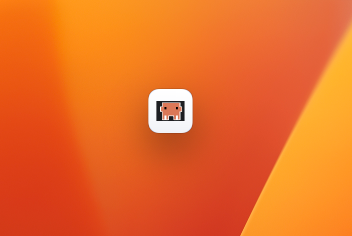

# TodoList

一个轻量、优雅的 macOS 桌面待办事项应用。悬浮圆球常驻屏幕，点击即可展开任务面板。

## 功能特性

- **悬浮圆球**：桌面常驻，按住拖拽移动，点击展开任务面板
- **任务管理**：创建、完成、删除、置顶待办事项
- **内联编辑**：点击任务标题即可编辑，Enter 保存，Escape 取消
- **归档功能**：已完成任务自动归档，支持恢复或永久删除
- **深色模式**：自动适配系统外观

## 界面预览

### 悬浮圆球


### 任务面板


## 下载安装

### macOS (arm64)

下载 `TodoList-1.0.0-arm64-mac.zip`，解压后将 TodoList.app 拖入 Applications 文件夹即可。

## 技术栈

- Electron + Vue 3 + TypeScript
- electron-vite 构建工具
- electron-builder 打包

## 开发

```bash
# 安装依赖
npm install

# 开发模式
npm run dev

# 构建
npm run build

# 打包
npm run dist
```

## License

MIT
